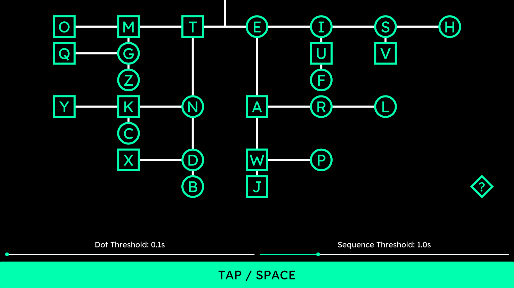
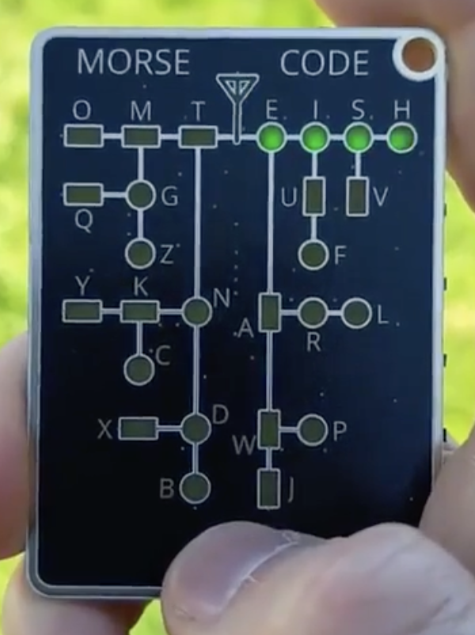

# morse-visualizer
Just a fun little program to help learn morse code graphically

### Guide
- dots are circles, dashes are squares
- dot threshold is how long the input has to be to be a dash
- sequence threshold is how long between inputs before its consider a new input sequence (letter)
- spacebar or bottom button click for inputs

### Demo


### Ideation
- reddit :D


### Windows Cross Compilation
```bash
cargo build --target x86_64-pc-windows-gnu --release
```
